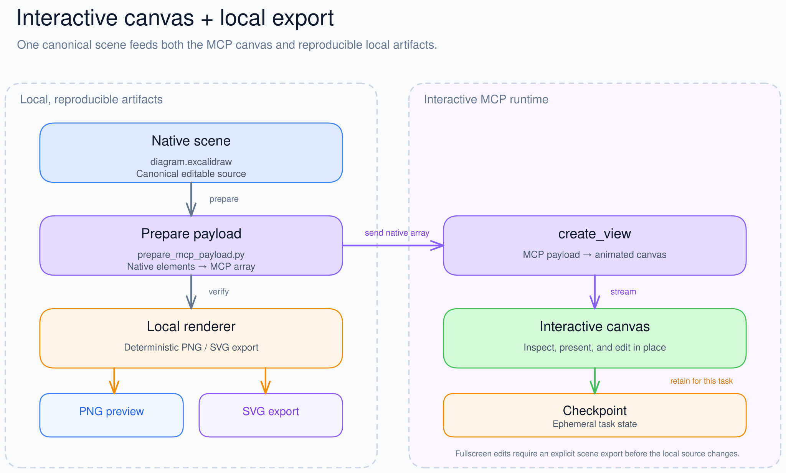
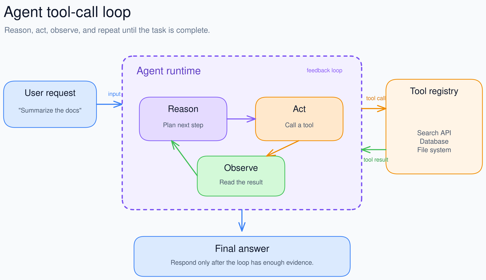
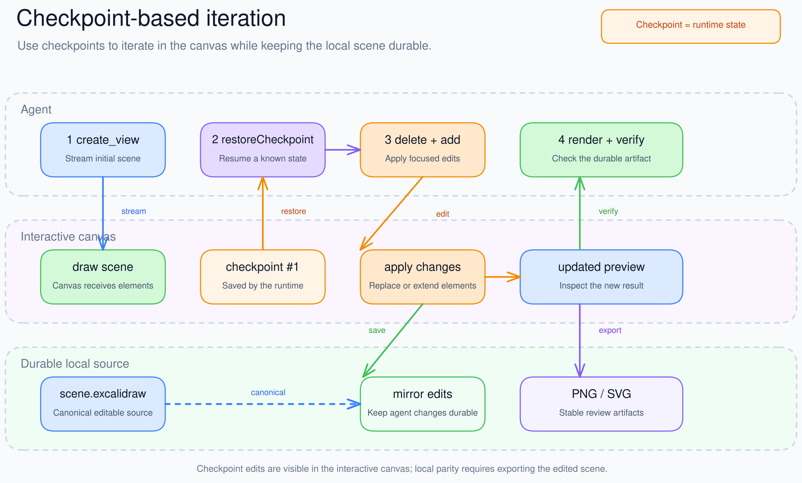

# Excalidraw Agent

[](https://github.com/chicogong/excalidraw-agent/actions/workflows/test.yml)
[](LICENSE)

An agent skill that connects the official Excalidraw MCP interactive canvas to durable `.excalidraw` sources and deterministic PNG/SVG exports.

<p align="center">
  
</p>

## What it connects

```text
native .excalidraw scene
├── prepare_mcp_payload.py → MCP create_view → interactive canvas + checkpoints
└── render_excalidraw.py   → deterministic PNG / SVG
```

- Draw and iterate in an MCP Apps-compatible chat client.
- Keep an editable local scene as the reproducible source of truth.
- Export PNG previews and real SVG files from the same source.
- Restore MCP checkpoints for focused edits without resending the full scene.
- Detect fidelity gaps when fullscreen edits have not yet been exported locally.

## Examples

### Agent tool-call loop

<p align="center">
  
</p>

[Editable source](examples/agent-tool-call-loop.excalidraw) · [PNG](examples/agent-tool-call-loop.png) · [SVG](examples/agent-tool-call-loop.svg)

### Checkpoint-based iteration

<p align="center">
  
</p>

[Editable source](examples/checkpoint-iteration.excalidraw) · [PNG](examples/checkpoint-iteration.png) · [SVG](examples/checkpoint-iteration.svg)

## Install

Clone the skill into your agent skills directory:

```bash
git clone https://github.com/chicogong/excalidraw-agent.git \
  .agents/skills/excalidraw-agent
```

Set up local rendering:

```bash
uv sync --project .agents/skills/excalidraw-agent/scripts
uv run --project .agents/skills/excalidraw-agent/scripts \
  playwright install chromium
```

For the interactive canvas, connect an MCP Apps-compatible client to:

```text
https://mcp.excalidraw.com/mcp
```

The MCP integration is optional. Local scene creation and export still work without it.

## Use

Invoke the skill naturally:

```text
Use $excalidraw-agent to draw this architecture, show it interactively,
and save editable, PNG, and SVG versions.
```

Export a local scene:

```bash
SKILL=.agents/skills/excalidraw-agent

uv run --project "$SKILL/scripts" python "$SKILL/scripts/render_excalidraw.py" \
  diagram.excalidraw --output diagram.png

uv run --project "$SKILL/scripts" python "$SKILL/scripts/render_excalidraw.py" \
  diagram.excalidraw --output diagram.svg
```

Prepare a native scene for the MCP `create_view` tool:

```bash
python "$SKILL/scripts/prepare_mcp_payload.py" \
  diagram.excalidraw --output /tmp/diagram.mcp.json
```

## State and fidelity

The local `.excalidraw` file is canonical whenever the result must be committed or reproduced. MCP checkpoints are runtime state.

The official MCP currently exposes `read_me` and `create_view` to the model. Full checkpoint read/save and upload operations are app-private. If a user manually edits the fullscreen canvas, export that edited scene before claiming that the local source is identical.

See [the MCP workflow](references/mcp-workflow.md) and [scene recovery guide](references/scene-recovery.md) for details.

## Test

```bash
uv sync --project scripts --locked
uv run --project scripts playwright install chromium
uv run --project scripts python scripts/test_renderer.py
uv run --project scripts python scripts/test_mcp_payload.py
```

Tests cover valid PNG/SVG output, repeatable hashes, native-scene conversion, camera sizing, shorthand rejection, and embedded-file boundaries.

## Dependencies

- [Excalidraw MCP](https://github.com/excalidraw/excalidraw-mcp) for the interactive canvas and checkpoints.
- [`@excalidraw/utils`](https://www.npmjs.com/package/@excalidraw/utils) for browser-side SVG generation.
- [Playwright](https://playwright.dev/python/) for repeatable local rendering.
- [uv](https://docs.astral.sh/uv/) for the Python environment.

The renderer downloads a pinned `@excalidraw/utils` browser module from jsDelivr. See [third-party notices](THIRD_PARTY_NOTICES.md) and [provenance](PROVENANCE.md).

## License

MIT © 2026 chicogong contributors.
